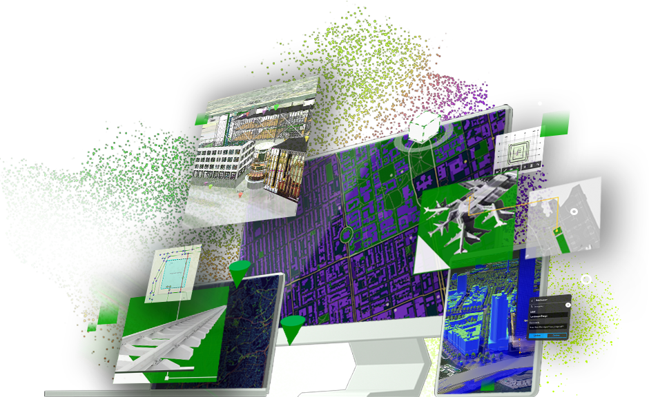

<!DOCTYPE html>
<html lang="en">
<head>
  <meta charset="UTF-8" />
  <meta name="viewport" content="width=device-width, initial-scale=1.0" />
  <title>{{ page.title }}</title>
  <link href="https://fonts.googleapis.com/css2?family=Inter:wght@400;600;700&display=swap" rel="stylesheet" />
  
</head>
<body>
  <button class="toggle-dark" onclick="document.body.classList.toggle('dark-mode')">🌓 Theme</button>

  <header>
    <h1>Kachy Nwobi</h1>
    
Geospatial Data Engineer | AEC & Urban Resilience | Data-Driven Storytelling

  </header>

  <nav>
    <a href="#about">About</a>
    <a href="#skills">Skills</a>
    <a href="#projects">Projects</a>
    <a href="#contact">Contact</a>
  </nav>

  <section id="about">
    <h2>About Me</h2>
    
I’m a geospatial data engineer with 5+ years of experience curating, transforming, and deploying spatial datasets to power intelligent decision-making across AEC, climate, and urban resilience domains.

  </section>

  <section id="skills" class="skills">
    <h2>Core Skills</h2>
    <table>
      <tr><td><strong>GIS Tools</strong></td><td>ArcGIS Pro, ArcGIS Online, ArcGIS Enterprise, QGIS, CityEngine</td></tr>
      <tr><td><strong>Data Tools</strong></td><td>GDAL, Python, SQL, GeoTIFF, GeoJSON, LAS/LAZ</td></tr>
      <tr><td><strong>AEC Platforms</strong></td><td>ArcGIS GeoBIM, Autodesk Forma, Revit, Civil 3D</td></tr>
      <tr><td><strong>Visualization</strong></td><td>Web maps, dashboards, 3D terrain</td></tr>
      <tr><td><strong>Collaboration</strong></td><td>GitHub, Jira, Figma</td></tr>
    </table>
  </section>

  <section id="projects">
    <h2>Featured Projects</h2>

    

      <h3>ArcGIS GeoBIM: Connecting GIS + BIM</h3>
      
Integrated BIM models with GIS features for 3D infrastructure coordination.

      
      
<a href="https://www.esri.com/en-us/arcgis/products/arcgis-geobim/overview">Learn more</a>

    

    

      <h3>ArcGIS for Autodesk Forma</h3>
      
Real-time GIS integration to support collaborative urban design workflows.

      
      
<a href="https://www.esri.com/en-us/arcgis/products/arcgis-for-autodesk-forma/overview">Learn more</a>

    

    

      <h3>PolicyMap: Mapping Vulnerability</h3>
      
Developed thematic maps for flood vulnerability and public infrastructure analysis.

      
      
<a href="https://policymap.wpengine.com/blog/the-midwest-floods-and-socially-vulnerable-populations">Read the article</a>

    

  </section>

  <section id="contact" class="contact">
    <h2>Connect With Me</h2>
    <a href="mailto:kachynwobi@gmail.com">Email</a>
    <a href="https://www.linkedin.com/in/kachy-nwobi-3463b64a/">LinkedIn</a>
    <a href="https://github.com/Kachynwobi/kachynwobi_portfolio/blob/7b2df8c69f2e50f516893cb96101ef6bee4d34a6/image/Kachy_Nwobi_Resume_GDE.pdf">Resume</a>
  </section>

  <footer>
    
© 2025 Kachy Nwobi · Powered by GitHub Pages

  </footer>
</body>
</html>
