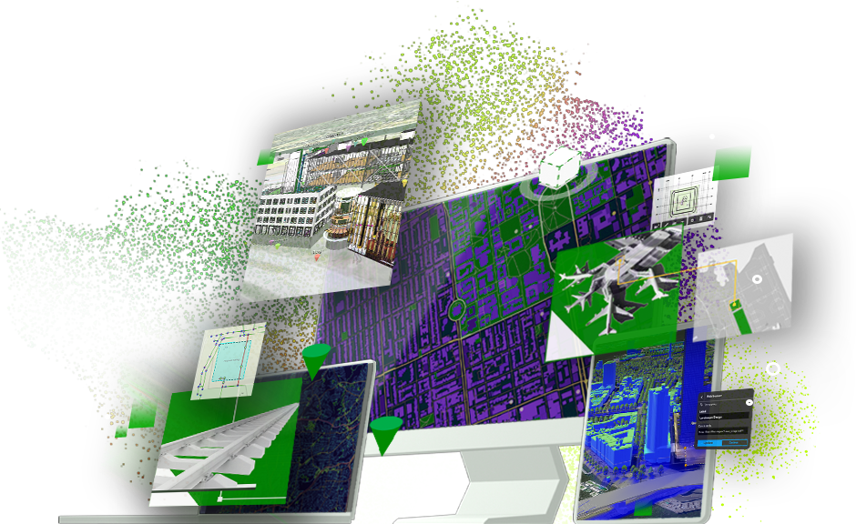
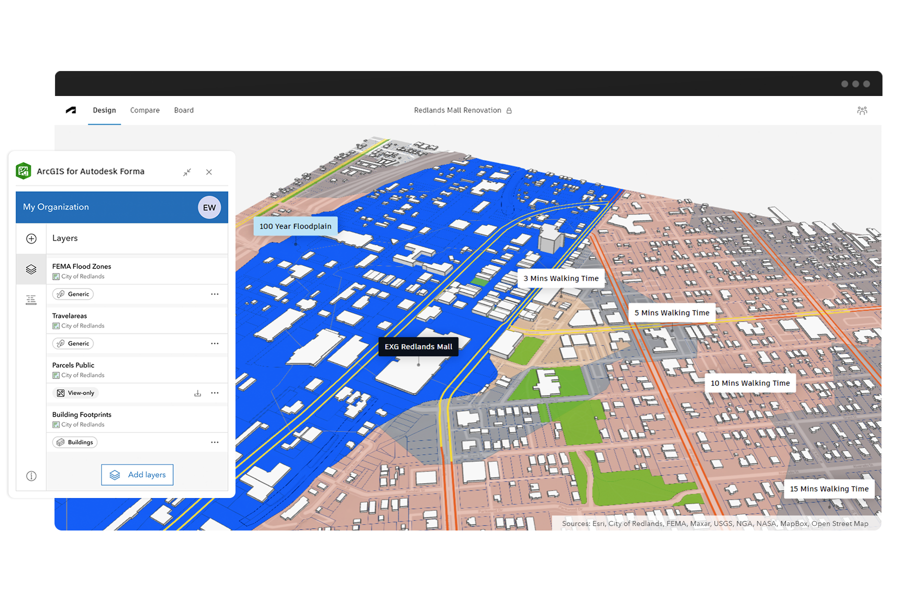
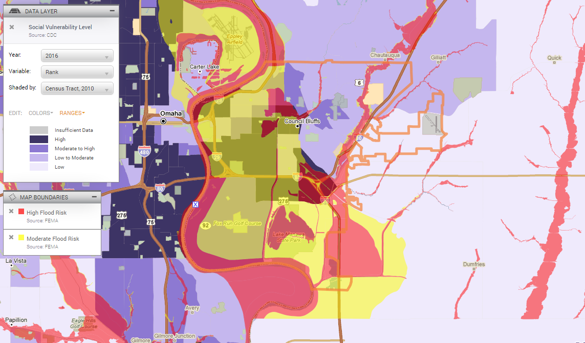

  <h1>Featured Projects</h1>
  

    <a href="README.md">← Back to Home</a>
  

---

### ArcGIS GeoBIM: Connecting GIS + BIM  
**Role:** Geospatial Product & Support Engineer, Esri  
[Learn more](https://www.esri.com/en-us/arcgis/products/arcgis-geobim/overview)  
- Processed and prepared spatial datasets for integration with cloud-based GIS and AEC platforms.
- Used GDAL and Python to align, resample, and validate raster and vector data across regions.
- Collaborated with engineering and product teams to identify gaps in data coverage and performance.
- Supported internal ML initiatives by curating and formatting diverse data types for training and validation.
- Documented technical workflows and contributed to tool development for internal data pipelines.

**Featured Blog Posts:**  
- [Customizing ArcGIS GeoBIM Web Maps and Scenes](https://www.esri.com/arcgis-blog/products/arcgis-geobim/3d-gis/customizing-arcgis-geobim-web-maps-and-scenes/)  
- [Using Autodesk Bridge with ArcGIS GeoBIM](https://www.esri.com/arcgis-blog/products/arcgis-geobim/3d-gis/using-autodesk-bridge-with-arcgis-geobim/)  
- [Generating Schedule Polygons with ArcGIS Pro](https://www.esri.com/arcgis-blog/products/arcgis-pro/3d-gis/generating-schedule-polygons-in-arcgis-pro/)  
- [Using User‑specified Coordinate Systems](https://www.esri.com/arcgis-blog/products/arcgis-geobim/3d-gis/using-user-specified-coordinate-systems-in-arcgis-geobim/)  

---

### ArcGIS for Autodesk Forma: Real-Time Urban Design  
**Role:** Geospatial Product & Support Engineer, Esri  
[Learn more](https://www.esri.com/en-us/arcgis/products/arcgis-for-autodesk-forma/overview)  
Real-time GIS integration to support collaborative urban design workflows.  

---

### PolicyMap: Mapping Vulnerability  
**Role:** GIS Data & Content Associate, PolicyMap  
[See project](https://policymap.wpengine.com/blog/the-midwest-floods-and-socially-vulnerable-populations)  
- Cleaned and standardized spatial data using SQL and ArcGIS tools for a national data platform.
- Assessed data quality, coverage, and freshness across multiple public and commercial sources.
- Wrote documentation and blog posts to support end users and explain datasets.
- Participated in QA and assisted with rolling out new platform features.  

---
